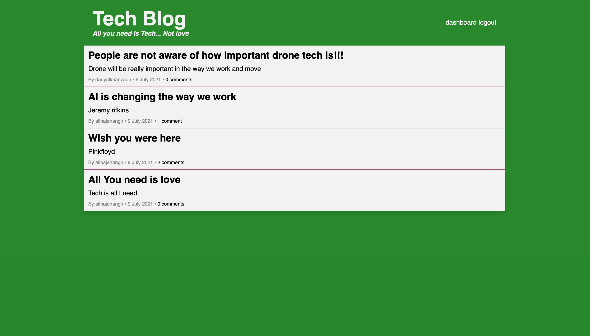

# Tech Blog &nbsp;&nbsp;&nbsp;

## Description

A tech blog website. Users can create an account with a username, password and an email account. Once logged in, users can create, edit, and delete posts via the dashboard.

User and post data is stored in a MySQL database using the Sequelize ORM. The app runs on a node server and is deployed via heroku.

The app can be found [here](https://dashboard.heroku.com/apps/lit-dawn-38821/deploy/heroku-git).

# Table of Contents
1. [Built Using](#built-using)
2. [Questions](#questions)
3. [License](#license)

## Built Using
- HTML
- CSS
- JavaScript
- Handebars.js
- MySQL
- Sequelize
- Node.js
- Express.js
- Heroku

## Questions
For additional questions, contact Danyal Khanzada:

GitHub: [DanyalKhanzada
](https://github.com/DanyalKhanzada)

## License
Under the MIT license, this material is free to modify and distribute for commercial or private use. See [here](https://opensource.org/licenses/MIT) for more details.
